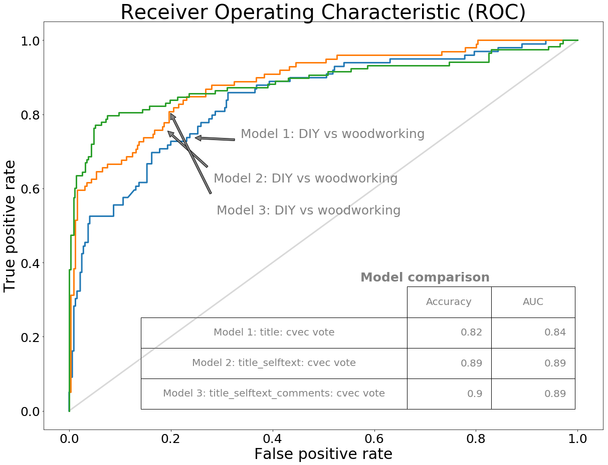
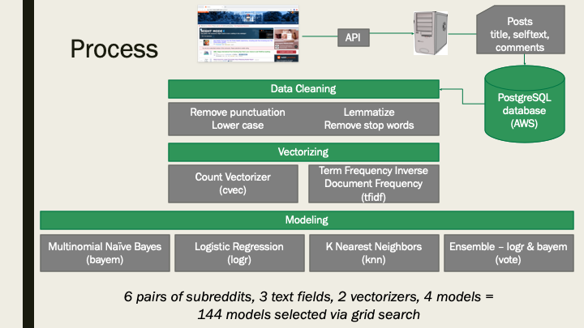

# Project 3: Web APIs and Classification

### Stephen Godfrey, DSI-CC7-San Francisco

### Problem Statement

Given a Reddit post, identify its source subreddit.

### Executive Summary

This project use Natural Language Processing (NLP) techniques to analyze [Reddit](https://www.reddit.com/) posts.  Specifically, the project's goal is to build models that can identify which subreddit a post came from, based on its title, content or associated comments.

Employing various data cleaning and modeling techniques yielded tools with predictive or classification power.  The models did a very good job of differentiating between subreddit categories in which posts could be expected to be dissimilar such as *relationships* and *Do It Yourself (DIY)* and less well, but still predictive, in differentiating between subreddit categories that are likely to have similar posts such as *DIY* and *woodworking*.

To address this challenge, Python tools were built to electronically consume posts through a connection to a simple JSON Application Programming Interface (API) available at Reddit Uniform Resource Locators (URL).  These posts and associated comments were stored in a SQL database running on Amazon Web Services (AWS) for further study.  This analysis consisted of cleaning, standardizing and vectorizing text fields and then using these data in four classification models to determine the best modeling technique (among these choices).  The Python tools consisted of custom class objects for retrieving Reddit posts and comments and specific functions for evaluating a large number of variable and model combinations.

Models were evaluated using several metrics including accuracy, confusion matrices and Receiver Operating Characteristic (ROC) curves.  An example of such model evaluation can be seen in the graph below.

### Conclusions and Recommendations

After data cleaning which itself involves several decision points, this analysis considered 144 variable and model combinations.  This consisted of pulling three text fields (title, selftest and comments) for four subreddits and using two vectorizers before feeding into four models.  To convert to an equation, this is six pairs of subreddits, three text fields, two vectorizers and four models for a total of 144 model-variable combinations.  And, these models were selected via grid search routines in which several hyper parameters were tied.  This process is depicted in the figure below.

Evaluating such a large set of variations, allows us to draw some conclusions:

* Among these subreddit categories, such models do a very good job of differentiating between dissimilar subreddits with accuracy scores approaching 100% and a good job of differentiating between similar subreddits with accuracy scores around 90%, 

* With these data, the best performing models varied by subreddit pair and it was not clear which vectorization-model combination would best generalize to all subreddit pairs, however Count Vectorization and Logistic Regression had the best average accuracy scores,

* When comparing text fields, using title, selftext and comments resulted in the best performance but adding comments is computationally intensive and provides only marginal benefit.

### Data

#### Data sources:

The data were collected by reading from the Reddit API on Saturday March 30, 2019 from 8:30 am - 10:30 am and 6:15 pm – 8:15 pm and again Wednesday April 3 from 9:00 - 9:30 AM. The following fields were extracted from the post and comments message and stored in a SQL database.  

#### Data dictionary:

|Column        |Description    |
|-----------------|--------------------|
|author_fullname  | ID of the author   |
|comments| comments to this post retrieved using the permalink element|
|created_utc| creation time|
|id| ID associated with this post|
|name| expanded ID tag|
|num_comments| numeric field in the post message|
|num_comments_cap| number of comments captured when reading comments|
|permalink| URL housing comments|
|selftext| Text of the post|
|subreddit| subreddit category housing this post|
|title| post title|

